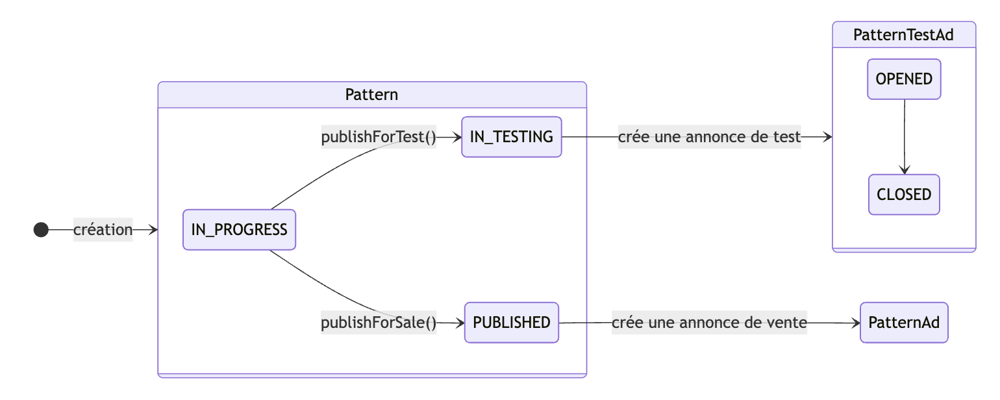
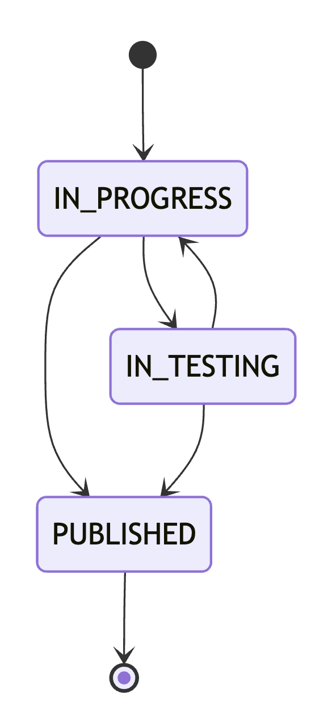

# **Domain Driven Design & Architecture Hexagonale**

## Démystifions la théorie par la pratique

---

# **Qui suis-je ?**

Salomé Jarnouën 
:cherry_blossom: Développeuse web full-stack chez :octopus: Liksi :octopus:

:cherry_blossom: Stack principale : Java/Spring Boot - Typescript/React

:yarn: Passionnée par le software craft(wo)manship et les fiber crafts

 Retrouvons-nous sur LinkedIn !


---

# **Introduction**

:cherry_blossom: expérimentation du DDD et de l'architecture hexagonale avec un cas concret
-> une application de gestion de patrons de crochet !
backend - SpringBoot 4 / Java 21

:cherry_blossom: objectifs :

- mettre en application des concepts théoriques
- définir des pistes de réflexion
- exposer des questions de modélisation

--- 

# **Définissons les concepts métiers**

| Nom               | Traduction  | Description                                                                             |
|-------------------|-------------|-----------------------------------------------------------------------------------------|
| Pattern (crochet) | Modèle      | Liste d'instructions pour réaliser un projet de crochet                                 |
| Hook              | Crochet     | Outil pour réaliser des ouvrages au crochet                                             |
| Yarn              | Fil         | Matériel utilisé pour réaliser un ouvrage au crochet. (laine, d'acrylique, de coton...) |
| Gauge             | Echantillon | Répétition du motif utilisé dans le pattern sur un nombre défini de mailles et de rangs |

---

# **Un peu de théorie : le Domain Driven Design**

DDD = approche de conception logicielle qui place le **domaine métier** au centre de toutes les décisions de modélisation / d'architecture

---

# Principes clés du DDD

- **Ubiquitous Language :** développeurs et experts métier parlent le même langage
  Si le métier parle de "patron", "jauge" et "instructions", le code utilise ```Pattern```, ```Gauge``` et ```instructions```.

---

# Principes clés du DDD

- **Entities :** objets avec une identité propre qui persiste dans le temps
  Un ```Pattern``` reste le même pattern même si on modifie son nom ou ses instructions.
- **Value Objects :** objets définis uniquement par leurs valeurs, sans identité
  Une ```Gauge``` (10 mailles, 12 rangs, 10cm x 10cm) est interchangeable avec toute autre gauge identique.


---

# Principes clés du DDD

- **Aggregates :** un ensemble d'objets traités comme une unité
  `Pattern` est la racine de l'agrégat : on accède à `Gauge` uniquement via `Pattern`, jamais directement.
- **Use Cases :** chaque opération métier est isolée dans sa propre classe
  `CreatePattern`, `UpdatePatternGauge`... Chaque use case fait une seule chose.
- **Repository :** une interface qui abstrait l'accès aux données
  Le domaine définit ce dont il a besoin, sans savoir comment c'est implémenté.

---

# **Un peu de théorie : l'architecture hexagonale (ou ports and adapters)**

idée centrale : **le domaine ne dépend de rien**. C'est le monde extérieur qui s'adapte à lui.

---

# Principes clés de l'hexagone

**Les 3 couches :**

- **Domaine :** entités, value objects, ports, use cases
  Regroupe la logique fonctionnelle, liée au métier. Ne doit pas inclure de traitements relatifs à la technique.

- **Application :** ce qui appelle les ports du domaine

- **Infrastructure :** ce que le domaine appelle via ses ports

---

# Notre modèle de domaine

<div style="display: flex; gap: 10px">


</div>

---
# 1-init

**Objectifs :** 
- Initialiser les fonctionnalités pour la gestion de `Pattern`
- Mettre en place la structure de base

```
src/main/java/com/crochet/pattern
├── domain/                 
│   ├── entities/            
│   ├── ports/               
│   └── usecases/            
├── infrastructure/          
│   └── persistence/
└── application/         
    └── rest/     
```

---

# 1-init

**L'entité métier : `Pattern`**

```java
public class Pattern {
	private PatternId id;
	private String name;
	private String instructions;
	private Gauge gauge;

	// Constructeur avec tous les paramètres (nécessaire pour le mapping)
	// Factory method
	// + accesseurs et mise à jour
}
```

---

# 1-init

**Le port : `PatternRepositoryPort`**

```java
public interface PatternRepositoryPort { 
	Pattern findById(UUID id);
	Pattern create(Pattern pattern);
	Pattern update(Pattern pattern);
}
```

C'est le **contrat** défini par le domaine. Le domaine dit "voici ce dont j'ai besoin", sans savoir comment c'est
implémenté.

---
# 1-init

**Les use cases**

Chaque opération métier est isolée dans sa propre classe :
- `CreatePattern` : créer un nouveau patron
- `GetPatternById` : récupérer un patron par son ID
- ...

---

# 1-init

**L'adapter JPA : `PatternRepositoryAdapter`**
Mapping : `Pattern` (domaine) ↔ `PatternDBO` (base de données)


**Le controller REST : `PatternController`**
Mapping : `CreatePatternRequest` → domaine → `PatternResponse`


**Le bootstrap : `PatternUseCasesConfiguration`**
Déclaration des beans Spring, pour faire fonctionner l'injection de dépendances.

---

# 2-errors-and-data-validation

**Objectifs :**  
- Ajouter la notion d'état dans `Pattern`
- Initialiser les annonces de test et de vente
- Valider le format des données et l'état interne d'un pattern

---

# 2-errors-and-data-validation

**Introduction d'un nouveau paramètre dans le domaine et en base**

```java {4,12-13}
public class Pattern {
  private PatternId id;
  private String name;
  private PatternState state;
  // ...
}

public class PatternDbo {
  @Id
  private UUID id;
  private String name;
  @Enumerated(EnumType.STRING)
  private PatternState state;
  // ...
}
```

---
# 2-errors-and-data-validation

**Nouveaux modules et leurs APIs : `patternAd` & `patternTestAd`**

```java
public interface PatternRepositoryPort {
  // transactions
  Pattern publishForTest(Pattern pattern);
  Pattern publishForSale(Pattern pattern, long price);
}

// src/pattern_test_ad
public interface PatternTestAdAPI {
  void create(UUID patternId, String name);
}

// src/pattern_ad
public interface PatternAdAPI {
  void create(UUID patternId, String name, long price);
}
```

---

# 2-errors-and-data-validation

**Validation de l'état interne**

```java
class Pattern {
  // ...
 
  // On utilise des checked exceptions : le domaine est obligé de fournir son contrat "complet" 
  // Signale la violation d'un invariant et doit être gérée par le 'caller' → on rend les erreurs métiers visibles intentionnelles 
  private void validateUpdateAllowed() throws PatternDomainException {
    if (isInTesting()) {
      throw PatternDomainException.patternAlreadyPublishedForTest(id);
    }
    if (isPublished()) {
      throw PatternDomainException.patternAlreadyPublishedForSale(id);
    }
  }
}
```

On retourne tout de suite une exception : un état invalide n'est pas acceptable et doit arrêter le processus

---

# 2-errors-and-data-validation

**Operation result pattern : l'objet `Result`**

```java
public sealed interface Result<T> permits Success, Failure {
	
  static <T> Result<T> success(T content) {
    return new Success<>(content);
  }

  static <T> Result<T> failure(List<String> errors) {
    return new Failure<>(errors);
  }
}
```
Distingue clairement les succès des erreurs. Permet d'accumuler les erreurs, notamment utile pour la validation de données.

---

# 2-errors-and-data-validation

**Validation des entrées : les `Specifications`**

```java
// Extraction des 'business rules' dans des spécifications réutilisables
public interface Specification<T> {
  Result<T> isSatisfiedBy(T candidate);
}
```
Validation hors de `Pattern` MAIS reste dans le domaine, réutilisable, et meilleure maintenabilité

```java
// record pattern matching
public Pattern create(String name) throws PatternValidationException {
    final var result = new PatternNameSpecification().isSatisfiedBy(name);
    return switch (result) {
        case Success<String> ignored -> repository.create(Pattern.create(name));
        case Failure<String>(var errors) -> throw new PatternValidationException(errors);
    };
}
```

---

# 2-errors-and-data-validation

**Erreurs exposées via l'API : `PatternApiError`**

```java
public record PatternApiError(HttpStatus status, List<String> errors) {
	public static PatternApiError notFound(final String message) {
		return new PatternApiError(HttpStatus.NOT_FOUND, List.of(message));
	}
	// ...
}
```

```java
// Exception handler
@ControllerAdvice(basePackages = "fr.salome.crochet.pattern")
public class PatternExceptionHandler { }
```

---

# 3-yarns-and-hooks

**Objectifs :** 
- Introduire les notions de fils et crochets
- Pouvoir les rattacher à un pattern et y accéder comme des données 'catalogue'

---

# 3-yarns-and-hooks

**Introduction d'un nouveau module : `materials`**

```
src/main/java/com/crochet/materials
├── domain/                 
│   └── entities/            
│       ├── Hook.java
│       └── Yarn.java                 
├── infrastructure/          
│   └── persistence/
├── application/         
│   └── rest/
└── MaterialsAPI.java
```

---

# 3-yarns-and-hooks

**Nouvel object value : `Materials`**

```java {4}
public class Pattern {
  private PatternId id;
  private String name;
  private Materials materials;
  // ...
}

// On n'enregistre que des IDs
public record Materials(List<UUID> yarnIds, List<UUID> hookIds) {}
```

---

# 3-yarns-and-hooks

**Validation de l'intégrité des données : `MaterialValidatorPort`**

```java
// déclaré dans le domaine Pattern
public interface MaterialValidatorPort {
  void validateYarnIds(List<UUID> yarnIds) throws PatternDomainException;
  void validateHookIds(List<UUID> hookIds) throws PatternDomainException;
}

// utilisé dans un use case
public Pattern updateYarns(PatternId id, List<UUID> newYarns) {
  materialValidator.validateYarnIds(newYarns);
  // ...
}

// implémenté dans la couche infrastructure
public class MaterialsValidatorAdapter implements MaterialValidatorPort {
  private final MaterialValidatorPort materialValidator;
}
```

---

# Bonus : les tests d'architecture

**`ArchUnit` : framework de test d'architecture**

```java
@ArchTest
static final ArchRule domainShouldBePure = DependencyRules.onlyAccessFromTo(DOMAIN_PACKAGE,
        DOMAIN_PACKAGE,
        KERNEL_PACKAGE,
        "java.."
);
```


---

# Conclusion

- nouvelle manière de réfléchir 
- beaucoup de code / mapping MAIS une fois les bases en place le dev est agréable 
- nécessité de se questionner et de refactorer régulièrement
- utilisez les outils à disposition : ArchUnit, Spring Modulith
- ne tentez pas d'appliquer tout à la perfection
- et surtout, essayez, échouez, posez-vous des questions et jouez avec les concepts !


Merci beaucoup :light_blue_heart:


